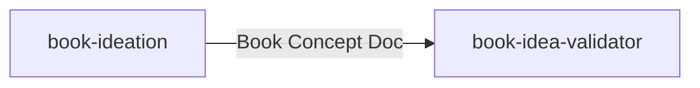
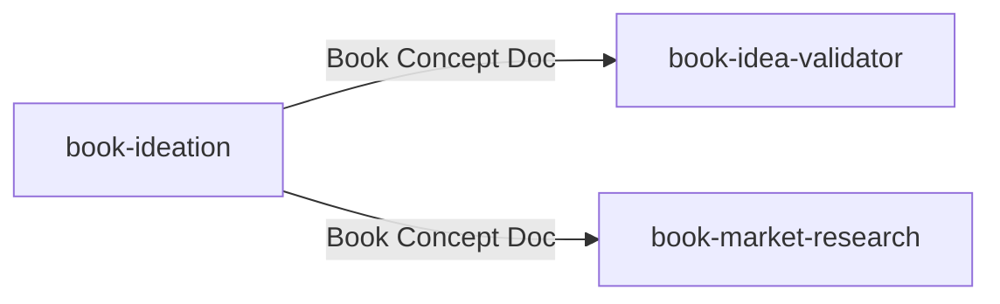
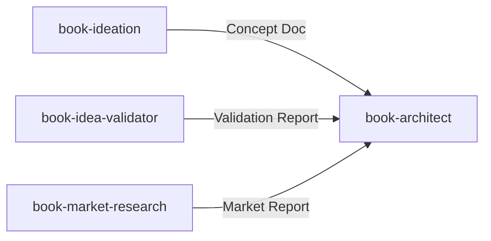
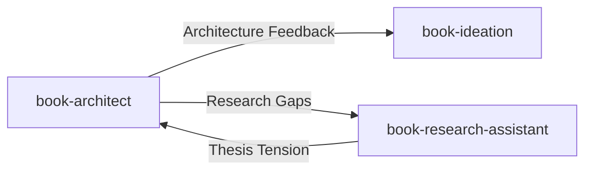

# Handoffs

The structured documents that pass between skills in a pipeline.

---

## What Are Handoffs?

When one skill completes its work, it produces a **handoff document**—a structured output that contains everything the next skill needs to continue. Handoffs are the connective tissue of pipelines.

Think of it like a relay race: the baton (handoff document) carries all the context so the next runner (skill) can continue without starting over.

---

## Anatomy of a Handoff

A typical handoff document contains:

| Section | Purpose |
|---------|---------|
| **Summary** | Quick orientation on what this represents |
| **Core Elements** | The substantive content the next skill needs |
| **Decisions Made** | What was decided, with reasoning |
| **Recommendations** | Guidance for the downstream skill |
| **Concerns/Flags** | Issues the next skill should address |
| **Readiness Status** | Whether this is complete or partial |

---

## Example: Book Concept Document

The `book-ideation` skill produces a Book Concept Document as its handoff:

```markdown
# Book Concept Document: [Title]

## Summary
[2-3 sentences describing the book]

## The Eight Elements

### 1. The Reader
[Specific description of who this is for]

### 2. The Transformation
Before: [Where reader starts]
After: [Where reader ends up]

### 3. The Core Thesis
[The one big idea someone can disagree with]

### 4. The Author Angle
[Why this author writes this book]

### 5. The Stakes
[Why it matters, why now]

### 6. The Key Concepts
[3-7 major ideas supporting the thesis]

### 7. The Enemy
[What this book argues against]

### 8. The Promise
[One sentence: what does the reader get?]

## Readiness
[Ready for validation / Needs more work on X]

## Notes for Downstream
[Any context the next skill should know]
```

This document then feeds into `book-idea-validator` and `book-market-research`.

---

## Handoff Patterns

### One-to-One

Simple handoff to the next skill:



### One-to-Many

Some handoffs feed multiple downstream skills:



### Accumulating Handoffs

Downstream skills often receive multiple handoffs:



---

## Readiness Criteria

Each handoff has explicit readiness criteria—conditions that must be met before the document is ready for downstream use.

### Example: Book Concept Document Readiness

The Book Concept Document is ready when:

- [ ] All eight elements are developed (not just listed)
- [ ] Reader can be described as a specific person
- [ ] Transformation has concrete before/after states
- [ ] Thesis is a claim someone can disagree with
- [ ] Promise is one compelling sentence

### Partial Handoffs

Sometimes work isn't complete but progress needs to continue:

```markdown
## Readiness: Partial

Ready for validation: Yes
Concerns: The Author Angle is underdeveloped—validator
should flag if this causes credibility concerns.
```

The downstream skill knows what to watch for.

---

## Handoff vs. Version Document

| Aspect | Handoff Document | Version Document |
|--------|------------------|------------------|
| Purpose | Pass to next skill | Continue within skill |
| Audience | Downstream skill | Same skill, next session |
| Content | Final outputs | Working state |
| Versioning | Single document | v1, v2, v3... |

A session might produce multiple version documents but culminate in one handoff document when the skill's work is complete.

---

## Common Handoff Documents

| Skill | Produces | Consumed By |
|-------|----------|-------------|
| book-ideation | Book Concept Document | book-idea-validator, book-market-research |
| book-idea-validator | Validation Report | book-market-research, book-architect |
| book-market-research | Market Research Report | book-architect |
| book-architect | Architecture Documents, Research Gaps | book-research-assistant, chapter-architect |
| book-research-assistant | Research Synthesis | chapter-architect |
| writing-dna-discovery | Voice DNA Document | ghost-writer |
| ebook-discovery | Discovery Tracker, Handoff Summary | ebook-concept-development |

---

## Creating Good Handoffs

### Do

- **Include reasoning, not just conclusions** — Downstream skills benefit from understanding why
- **Flag concerns explicitly** — Don't hide problems; surface them for the next skill
- **Meet readiness criteria** — Don't handoff incomplete work without marking it partial
- **Use consistent structure** — Templates enable reliable consumption

### Don't

- **Dump raw session content** — Handoffs are curated, not transcripts
- **Assume context** — The downstream skill may be a fresh Claude instance
- **Skip the summary** — Quick orientation helps the next skill engage faster

---

## When Handoffs Flow Backward

Sometimes downstream skills discover problems that require upstream revision:



This feedback loop ensures quality: if research reveals the thesis is flawed, that information flows back to architecture for structural revision.

---

## Related Concepts

- [Pipelines](pipelines.md) — How skills chain together
- [Session Continuity](session-continuity.md) — Working within a skill across time
- [Modes & Registers](modes-and-registers.md) — Adapting to different situations
