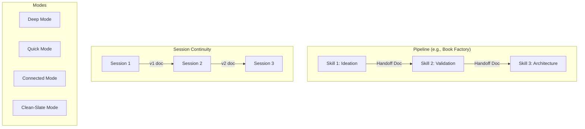

# Concepts

Understanding the key ideas behind how Claude Skills work.

---

## Core Concepts

-   :material-pipe:{ .lg .middle } **[Pipelines](pipelines.md)**

    ---

    How skills chain together in sequences, with structured handoffs between stages.

-   :material-clock-outline:{ .lg .middle } **[Session Continuity](session-continuity.md)**

    ---

    How skills maintain context across sessions spanning days or weeks.

-   :material-swap-horizontal:{ .lg .middle } **[Handoffs](handoffs.md)**

    ---

    The structured documents that pass between skills in a pipeline.

-   :material-toggle-switch:{ .lg .middle } **[Modes & Registers](modes-and-registers.md)**

    ---

    Different operating modes skills offer for different situations.

---

## Why These Concepts Matter

Skills aren't just instruction sets—they're designed systems with specific patterns that make them powerful:

| Concept | Problem It Solves |
|---------|-------------------|
| **Pipelines** | Complex work needs specialists, not generalists |
| **Session Continuity** | Creative work happens over time, not in one sitting |
| **Handoffs** | Each specialist needs clear input from the previous |
| **Modes** | Different situations need different approaches |

---

## How They Work Together

A typical workflow combines all these concepts:

1. You start a **pipeline** at the first skill
2. Across multiple **sessions**, you develop the work (continuity via versioned documents)
3. You choose appropriate **modes** based on your situation
4. When ready, the skill produces a **handoff document** for the next skill

---

## Next Steps

- [:octicons-arrow-right-24: Pipelines](pipelines.md) — Start here to understand skill sequences
- [:octicons-arrow-right-24: Session Continuity](session-continuity.md) — How work persists across time
- [:octicons-arrow-right-24: Handoffs](handoffs.md) — What passes between skills
- [:octicons-arrow-right-24: Modes & Registers](modes-and-registers.md) — Adapting to different situations
