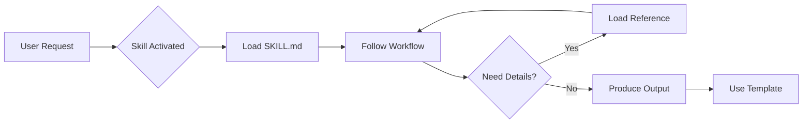

# What Are Skills?

Skills are modular packages that transform Claude from a general-purpose assistant into a specialized collaborator for specific domains and workflows.

---

## The Problem Skills Solve

Claude is incredibly capable out of the box, but for complex, domain-specific work, you often need to:

- Explain your workflow every time
- Remind Claude of best practices and frameworks
- Provide templates for consistent output
- Reference detailed documentation repeatedly

Skills solve this by packaging all of that context into a reusable module that Claude can load on-demand.

---

## What's Inside a Skill?

Each skill contains three types of content:

### 1. Instructions (SKILL.md)

The core of every skill. This file contains:

- **Workflow guidance** — How to approach the domain step-by-step
- **Decision frameworks** — When to use different methods or approaches
- **Quality standards** — What good output looks like
- **Session patterns** — How to start, progress, and end sessions

### 2. Reference Documentation (references/)

Deep knowledge that Claude loads on-demand to preserve context:

- Detailed method explanations
- Domain-specific frameworks
- Best practices and anti-patterns
- Research and evidence

### 3. Templates (assets/)

Structured formats for consistent output:

- Project document templates
- Tracker templates
- Report formats
- Handoff documents

---

## How Skills Work

1. **Activation** — When your request matches a skill's domain, Claude loads the skill
2. **Workflow** — Claude follows the skill's prescribed approach
3. **Progressive Disclosure** — Detailed references load only when needed
4. **Structured Output** — Templates ensure consistent, useful deliverables

---

## Types of Skills

### Standalone Skills

Self-contained skills for specific tasks:

- **Brainstorm** — Multi-session ideation with versioned documents

### Pipeline Skills

Skills designed to work together in sequence:

- **Non-Fiction Book Factory** — From idea → validation → market research → architecture → chapters
- **Ebook Factory** — From discovery → concept development
- **Writing** — From voice DNA discovery → ghost writing

Pipeline skills pass structured "handoff documents" between stages, ensuring continuity and quality.

---

## Key Concepts

### Session Continuity

Many skills support multi-session workflows spanning days or weeks. They do this through:

- **Versioned documents** — Each session creates a new version (v1, v2, v3...)
- **Session logs** — Track what happened when
- **Decision logs** — Capture reasoning, not just conclusions

### Modes

Some skills offer different operating modes:

- **Connected mode** — Claude surfaces connections to other work
- **Clean-slate mode** — Fresh thinking without prior context
- **Quick mode** — Rapid progress vs. deep exploration

### Handoffs

Pipeline skills produce structured handoff documents that:

- Summarize what was accomplished
- Meet explicit readiness criteria
- Provide everything the next skill needs

---

## Benefits of Using Skills

| Without Skills | With Skills |
|----------------|-------------|
| Explain workflow each time | Workflow is pre-defined |
| Inconsistent output format | Templates ensure consistency |
| Context lost between sessions | Versioned documents maintain history |
| Ad-hoc quality standards | Built-in quality checks |
| Generic responses | Domain-specialized collaboration |

---

## Next Steps

Ready to start using skills?

- [:octicons-arrow-right-24: Claude Code Setup](installation-claude-code.md)
- [:octicons-arrow-right-24: Claude.ai Setup](installation-claude-ai.md)
- [:octicons-arrow-right-24: Your First Skill Tutorial](your-first-skill.md)
