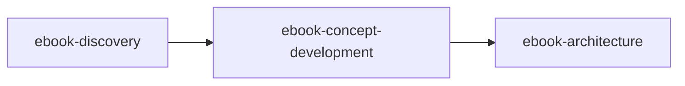

# Ebook Concept Development

> Develop ebook ideas into structured concepts ready for architecture. Takes a single idea and develops it into a clear Ebook Concept Document with reader, transformation, promise, content source, scope/format, and key topics.

---

## Overview

The Ebook Concept Development skill takes ONE ebook idea and develops it into a structured concept ready for architecture. Unlike generic brainstorming, this skill constantly applies ebook-specific pressure: format-fit calibration, value density thinking, and transformation sizing.

This is genuine intellectual partnership—Claude contributes substance, offers observations, and pushes back on weak ideas with reasoning. Every element must earn its place in an ebook's concentrated solution.

---

## Quick Start

### Prerequisites

- An ebook idea from any source:
  - Fresh concept
  - Brainstorm document from [Ebook Discovery](ebook-discovery.md)
  - Existing content to repurpose
  - Section from a larger book to extract

### Basic Usage

=== "Claude Code"

    ```markdown
    When developing ebook concepts, read and follow /path/to/claude-skills/ebook-factory/ebook-concept-development/SKILL.md.
    ```

=== "Claude.ai"

    Upload `ebook-concept-development.skill` to Settings → Skills.

**Sample prompt:**
```
I have an ebook idea I want to develop. Here's what I'm thinking: [describe idea]
```

---

## Features

| Feature | Description |
|---------|-------------|
| **Ebook-Specific Pressure** | Format-fit calibration, value density, transformation sizing |
| **Five Core Elements** | Reader, Transformation, Promise, Content Source, Scope & Format |
| **Situational Elements** | Value Gap and Enemy surface when relevant |
| **Living Document** | Updated at milestones, not constantly |
| **Stress Testing** | Coherence and viability check before handoff |
| **Multi-Session Support** | Pick up exactly where you left off |

---

## The Five Core Elements

Every ebook concept needs these developed:

| Element | Core Question | "Developed" Means |
|---------|---------------|-------------------|
| **Reader** | Who specifically is this for? | A specific person, not a category. Their situation, problem, what they've tried. |
| **Transformation** | Where before → where after? | Concrete states. You can picture the person at each point. |
| **Promise** | What does the reader get? | One compelling sentence. Specific, believable, would make someone pay. |
| **Content Source** | What existing content feeds this? | Clear inventory: original, repurposed, or extracted from larger work. |
| **Scope & Format** | What's the shape? | Word count range, format type, platform, what's explicitly OUT. |

---

## Situational Elements

These surface naturally when signals appear—never forced:

| Element | When It Applies | Signal Phrases |
|---------|-----------------|----------------|
| **Value Gap** | Creator-led ebooks (repurposed content) | "I have videos on this," "my newsletter covers this" |
| **Enemy** | Argument-driven ebooks | "Most people think X but actually Y," "conventional wisdom is wrong" |

---

## Ebook-Specific Calibration

What makes this different from generic brainstorming:

### Format-Fit Calibration

Is this genuinely ebook-sized?

- **Too thin** = blog post
- **Too thick** = full book
- **Just right** = concentrated solution in 5,000-25,000 words

### Value Density Thinking

Ebooks are concentrated solutions. Every element must earn its place. If content could be cut without losing value, it should be.

### Transformation Sizing

Ebook transformations are tight and specific, not sprawling. "Go from confused about X to confidently doing Y" not "become a complete expert in everything."

---

## Workflow

### Arriving with Material

You might bring:

- A single sentence idea
- A rough paragraph
- A brainstorm document from Ebook Discovery
- Existing content to repurpose
- A section from a larger book

Claude reads the room—coming in hot with analysis for developed material, drawing out more for thin material.

### First Response Pattern

After receiving material, Claude provides:

1. Summary of the core idea as understood
2. What seems strongest or clearest
3. What seems fuzzy or underdeveloped
4. Initial observations or concerns (with reasoning)
5. One focused question to start developing

### During the Session

**Collaboration behaviors:**

- Proactive observations: "I notice the transformation has two stages—is this one ebook or two?"
- Challenge with reasoning: "The scope feels ambitious because you're describing three distinct skill-building stages."
- Surface connections: "Your reader and promise seem misaligned—reader is beginners but promise assumes they understand X."

**Working the elements:**

- Don't march through elements like a checklist
- Follow natural conversation flow
- Acknowledge when elements become developed
- Circle back to fuzzy elements naturally

### Readiness and Stress Test

When elements feel developed, Claude offers a stress test:

**Element quality:**
- Reader specific enough for real decisions?
- Transformation has clear before/after?
- Promise compelling enough to pay for?
- Scope genuinely ebook-sized?
- Topics sufficient to deliver transformation?

**Internal coherence:**
- Does everything align? (Reader → Transformation → Promise → Topics)
- Any contradictions?
- Does format serve content and reader?

**Viability concerns:**
- Any red flags noticed during development?
- Anything forced or uncertain?

---

## Inputs & Outputs

### Inputs

| Input | Description |
|-------|-------------|
| Ebook idea | Any form—sentence, paragraph, brainstorm document, existing content |
| Working document | If continuing a previous session |

### Outputs

| Output | Description |
|--------|-------------|
| **Ebook Concept Document** | Living document with all elements, decisions, and reasoning |
| **Readiness Verdict** | Clear when concept is ready for architecture |

---

## Readiness Criteria

Ready for architecture when:

- [ ] Reader can be described as a specific person
- [ ] Transformation has clear before/after states
- [ ] Promise is one compelling sentence
- [ ] Scope is defined and genuinely ebook-sized
- [ ] Key topics/concepts identified
- [ ] Value Gap articulated (if creator-led)
- [ ] Stress test passed

---

## Best Practices

- **One question at a time** — Never overwhelm with multiple questions
- **Reasoning with every pushback** — "This scope feels too big because..." not just "feels too big"
- **Surface problems early** — Better to kill weak concept now than finish weak ebook
- **Don't force situational elements** — Let Value Gap and Enemy emerge naturally
- **Update document at milestones** — Not after every exchange

---

## Integration

### Pipeline Position



### Upstream Skills

- **[Ebook Discovery](ebook-discovery.md)** — Provides brainstorm documents with candidate ideas

### Downstream Skills

- **Ebook Architecture** — Receives validated Ebook Concept Document

---

## References

The skill loads these as needed:

- `format-options.md` — Catalog of ebook formats (prose, workbook, etc.)
- `element-examples.md` — Good/bad examples for each element
- `failure-patterns.md` — Anti-patterns and warning signs

---

## Examples

### Example 1: Developing from Discovery Output

**Input:** Brainstorm document with 3 candidate ideas, user has selected one to develop.

**Session flow:**
1. Claude reads brainstorm, confirms which idea to develop
2. Provides initial analysis of what's clear vs. fuzzy
3. Focuses first question on reader specificity
4. Works through elements naturally via conversation
5. Runs stress test when elements feel developed
6. Produces final Ebook Concept Document

### Example 2: Repurposed Content

**Input:** "I have a 12-video course on productivity. Want to extract an ebook."

**Session flow:**
1. Claude asks about course content structure
2. Identifies Value Gap early (creator-led signal)
3. Works to identify which portion = ebook vs. full course
4. Calibrates scope to ebook format
5. Develops transformation specific to extracted portion
6. Stress tests coherence between source content and concept

---

## Related Skills

- [Ebook Discovery](ebook-discovery.md) — Generate ebook ideas to feed this skill
- [Brainstorm](../brainstorm/index.md) — General ideation that might produce ebook candidates
