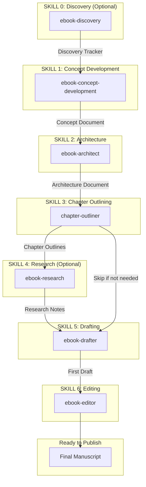

# Ebook Factory

> A streamlined pipeline for creating high-quality ebooks - concentrated solutions optimized for speed-to-value.

## Overview

The Ebook Factory is a suite of Claude skills designed specifically for ebook creation. Unlike the Book Factory (designed for 50,000-80,000 word nonfiction books), this pipeline is right-sized for 10,000-25,000 word ebooks that can be completed faster with lighter process overhead.

The core philosophy: **Ebooks are not compressed books - they are a distinct format optimized for speed-to-value.** The constraint of being shorter makes ebooks harder to write well, not easier. Every sentence must earn its place. The reader who buys a short read values their time and expects density without filler.

## Pipeline Overview

## Pipeline Characteristics

| Characteristic | Description |
|----------------|-------------|
| **Linear but flexible** | Skills flow in sequence, but some may be compressed or skipped |
| **Single-session default** | Each skill designed to complete in one focused session |
| **Chapter-by-chapter option** | Outlining and drafting can work incrementally with review points |
| **Research is conditional** | Not every ebook needs dedicated research |
| **Discovery is optional** | Users with existing ideas skip straight to Concept Development |

## Ebooks vs. Full Books

| Aspect | Ebook | Full Book |
|--------|-------|-----------|
| **Word Count** | 10,000-25,000 | 50,000-80,000 |
| **Timeline** | Weeks | Months |
| **Transformation** | Single, focused | Multi-stage, comprehensive |
| **Reading Sessions** | 1-3 sessions | Multiple sessions |
| **Chapter Count** | 4-8 chapters | 12-20+ chapters |
| **Process Weight** | Lighter documentation | Thorough documentation |
| **AI Role** | Primary drafter | Coach/collaborator |

## When to Use This Pipeline

**Use Ebook Factory when:**
- Your transformation is tight and specific
- The content naturally fits 10,000-25,000 words
- You want to ship quickly
- You're repurposing existing content (videos, blog posts, newsletters)
- You're testing audience interest before a larger book
- The reader's problem can be solved in 1-3 reading sessions

**Use Book Factory when:**
- Your transformation requires multiple sequential stages
- The topic demands comprehensive treatment
- You need extensive research and evidence
- The content naturally expands to 50,000+ words
- You're building a definitive resource

## Design Principles

### 1. Single Document Per Skill
Each skill produces one working document rather than multiple files. Simpler to track, easier to pass forward.

### 2. Embedded References
Essential guidance is embedded in skills rather than split across many reference files. References are limited to catalogs and templates that would bloat the main skill.

### 3. Single-Session Default
Skills are designed to complete in one focused session. This creates momentum and prevents projects from stalling.

### 4. Reader-First, Always
Every decision - structural, stylistic, content - is evaluated from the reader's perspective. Will this help the reader understand? Keep them engaged? Move them toward transformation?

### 5. Claude as True Collaborator
Claude is not an assistant waiting for instructions. Claude contributes ideas proactively, pushes back on weak thinking, challenges assumptions, and brings genuine expertise.

### 6. Brutal Honesty Over Ego Protection
The skills exist to surface problems early when they're cheap to fix. Better to kill a weak idea now than finish a weak ebook later.

### 7. Quality Through Constraint
Brevity is the discipline. The constraint of being shorter forces higher quality per page.

## Skills in This Pipeline

| Skill | Status | Purpose |
|-------|--------|---------|
| [ebook-discovery](./ebook-discovery.md) | Built | Surface ebook ideas you didn't know you had |
| [ebook-concept-development](./ebook-concept-development.md) | Built | Develop ideas into structured concepts |
| ebook-architect | Planned | Design the reader's journey and chapter structure |
| chapter-outliner | Planned | Create beat-level outlines for each chapter |
| ebook-research | Planned | Fill research gaps identified during planning |
| ebook-drafter | Planned | Produce the complete first draft |
| ebook-editor | Planned | Refine draft into polished final manuscript |

## Handoffs Between Skills

Clear handoffs ensure continuity between skills:

### Discovery to Concept Development
- Discovery Tracker with evaluated candidates
- Candidate handoff summary for chosen idea
- User profile (intent, content inventory, expertise)
- Viability assessment with reasoning

### Concept Development to Architecture
- Ebook Concept Document with all elements developed
- Scope boundaries defined
- Platform direction
- Open questions identified

### Architecture to Outlining
- Ebook Architecture Document with full chapter sequence
- Each chapter's job, entry/exit states, word budget
- Research gaps and visual needs identified

### Outlining to Drafting
- Complete chapter outlines with beats
- Word budgets per beat
- Subheading suggestions
- Opening/closing approaches

### Drafting to Editing
- Complete first draft
- Inline flags and placeholders
- Draft self-assessment
- Voice parameters used

## Related Resources

- [Non-Fiction Book Factory](../non-fiction-book-factory/index.md) - For full-length books
- [Pipelines Concept](../../concepts/pipelines.md) - Understanding skill pipelines
