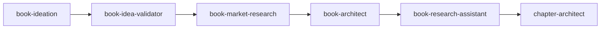

# Book Architect

> Design the structural and emotional architecture for nonfiction books. Creates the comprehensive blueprint before drafting—every structural decision serves the reader's transformation journey.

---

## Overview

The Book Architect skill designs the reader's journey and creates a comprehensive structural blueprint for nonfiction books. The guiding principle: the question is never "how do I organize my ideas?" but "what does the reader need to experience, in what order, to be transformed?"

This skill creates **dual architecture**—both structural architecture (what goes where) and emotional architecture (what the reader feels and experiences). Chapters aren't containers for content; they're journeys that transform readers from an entry state to an exit state.

Claude operates as an expert collaborator: direct about architectural problems, pushing back on weak structure, but warm toward the author—ruthless toward the architecture, supportive of the person.

---

## Quick Start

### Prerequisites

- Book Concept Document (required)
- Validation Report (recommended)
- Market Research Report (recommended)

### Basic Usage

=== "Claude Code"

    ```markdown
    When architecting a book, read and follow /path/to/claude-skills/non-fiction-book-factory/book-architect/SKILL.md.
    ```

=== "Claude.ai"

    Upload `book-architect.skill` to Settings → Skills.

**Sample prompt:**
```
I'm ready to architect my book. Here are my upstream documents:
- Book Concept Document: [paste]
- Validation Report: [paste]
```

---

## Features

| Feature | Description |
|---------|-------------|
| **Dual Architecture** | Structural (what goes where) + Emotional (what reader feels) |
| **Reader-First Design** | Every decision justified by reader experience |
| **Intake Assessment** | Synthesizes upstream documents, checks readiness |
| **Structural Frameworks** | Catalog of proven structures with guidance |
| **Hook Chain Design** | Each chapter's exit pulls into next chapter's entry |
| **Pacing Strategy** | Intentional rhythm—no accidental slog zones |
| **Research Gap Identification** | Surfaces what needs filling before drafting |

---

## Core Philosophy

1. **Reader-first architecture** — Every decision is justified by reader experience, not author convenience

2. **Chapters are journeys, not containers** — Each transforms the reader from entry state to exit state

3. **Diagnose before prescribing** — Assess what THIS book needs rather than applying a formula

4. **Expert with warmth** — Direct about problems, supportive of the person

---

## Workflow

### Intake Process

Claude reads all provided documents and produces:

1. **Synthesis Statement** — "Here's what I understand this book to be..."
2. **Readiness Verdict** — Green / Yellow / Red
3. **Structural Intuitions** — Initial hunches (not decisions—starting points)
4. **Concerns & Questions** — Issues to address
5. **The Burning Question** — Single most important thing to resolve
6. **Proposed Work Plan** — Sessions needed, sequence of work

### Readiness Signals

**Green (ready to proceed):**
- Thesis implies structure
- Transformation has verbs (reader will START doing X, STOP doing Y)
- Key concepts have relationships
- Enemy is specific enough to create drama

**Red (needs upstream work):**
- Multiple books hiding as one
- Unresolved validation concerns
- Market positioning contradicts concept
- Cannot articulate book in one clear paragraph

### Building Architecture

**Book-Level:**
- Refine thesis and promise statement
- Map transformation arc (stages reader moves through)
- Select structural framework
- Identify through-lines (themes woven throughout)
- Map objections and resistance points
- Assess proof burdens
- Design pacing strategy

**Chapter-Level:**
- Work section by section
- Define all blueprint elements for each chapter
- Ensure hook chain flows
- Watch for pacing problems
- Flag research gaps as they emerge

---

## Inputs & Outputs

### Inputs

| Input | Required | Source |
|-------|----------|--------|
| Book Concept Document | Yes | book-ideation |
| Validation Report | Recommended | book-idea-validator |
| Market Research Report | Recommended | book-market-research |
| Existing notes/outline | Optional | Author |

### Outputs

| Document | Description |
|----------|-------------|
| **Master Architecture Document** | Book identity, reader profile, transformation arc, framework rationale, section overview, through-lines, objection map, proof burden map, pacing strategy |
| **Section Blueprint Documents** | One per section with detailed chapter blueprints |
| **Research Gaps Document** | Prioritized gaps with ready-to-use research prompts |
| **Progress Tracker** | Session continuity and status |
| **Decision Log** | Architectural choices with reasoning |

---

## Chapter Blueprint Elements

Each chapter blueprint includes:

- Chapter number, title, type, one-line description
- Chapter weight (Heavy/Medium/Light)
- Incoming hook, outgoing hook
- Reader emotional arc (starts/ends)
- Key insight (the ONE thing)
- Purpose (chapter's job)
- Content outline
- Through-line moments
- Structural connections
- What NOT to include
- Proof burden notes
- Resistance points
- Research gaps

---

## Readiness Criteria

Architecture is complete when:

1. Master Architecture Document is finalized
2. All Section Blueprints complete with every field filled
3. Hook chain flows end-to-end
4. Pacing shows intentional rhythm
5. Every chapter has a distinct key insight
6. All P1 research gaps documented with prompts
7. Stress test passes
8. Author confirms this is the book they want to write

---

## Best Practices

- **Provide all upstream documents** — Better input = better architecture
- **Trust the intake process** — Let Claude identify readiness issues
- **Accept pushback on structure** — That's where value lives
- **Don't rush chapters** — Each blueprint deserves full attention
- **Use the decision log** — Future you will appreciate the reasoning

---

## Integration

### Pipeline Position



### Upstream Skills

- **book-ideation** — Provides Book Concept Document
- **book-idea-validator** — Provides Validation Report
- **book-market-research** — Provides Market Research Report

### Downstream Skills

- **book-research-assistant** — Receives Research Gaps Document
- **chapter-architect** — Receives Section Blueprints

---

## References

The skill loads these as needed:

- `structural-frameworks.md` — Catalog of proven structures
- `reader-resistance.md` — Types of objections and strategies
- `pacing-cognitive-load.md` — Chapter weight and rhythm
- `chapter-architecture.md` — Entry/exit states, hooks
- `proof-burden-mapping.md` — What evidence claims need
- `common-problems.md` — Architectural antipatterns

---

## Related Skills

- [Book Ideation](book-ideation.md) — Creates the concept document
- [Book Idea Validator](book-idea-validator.md) — Validates intellectual merit
- [Book Market Research](book-market-research.md) — Validates commercial viability
- [Book Research Assistant](book-research-assistant.md) — Fills research gaps
- [Chapter Architect](chapter-architect.md) — Beat-level chapter planning
