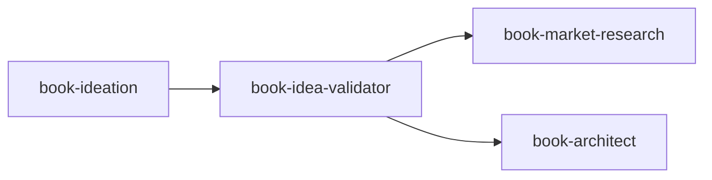

# Book Idea Validator

> Stress-test book concepts against existing research before committing to architecture. Produces a Validation Report with Go/Revise/Kill recommendation. The goal is intellectual honesty, not ego validation.

---

## Overview

The Book Idea Validator stress-tests the core ideas from your Book Concept Document against existing research, surfacing weaknesses early—when they're cheap to fix or when killing the project saves months of wasted effort.

This skill operates on a fundamental principle: **better to kill a weak idea now than to finish a weak book later.** Claude functions as an intellectual partner who brings genuine contributions, pushes back on problems, and remains brutally honest about what works and what doesn't.

The validation uses a two-layer research model: Claude performs landscape scans to map territory, then provides targeted prompts for deep research that you execute independently.

---

## Quick Start

### Prerequisites

- Completed [Book Concept Document](book-ideation.md) with all 8 core elements
- Book Ideation skill outputs ready for validation

### Basic Usage

=== "Claude Code"

    ```markdown
    When validating book ideas, read and follow /path/to/claude-skills/non-fiction-book-factory/book-idea-validator/SKILL.md.
    ```

=== "Claude.ai"

    Upload `book-idea-validator.skill` to Settings → Skills.

**Sample prompt:**
```
I have a Book Concept Document ready for validation. Here it is: [paste document]
```

---

## Features

| Feature | Description |
|---------|-------------|
| **Two-Layer Research** | Landscape scan (Claude) + Deep research (user-executed with Claude-provided prompts) |
| **Claim Extraction** | Systematically identifies all claims requiring validation |
| **Competitor Analysis** | Maps the intellectual territory and identifies gaps |
| **Kill Signal Detection** | Flags serious concerns that could sink the book |
| **Green Light Identification** | Surfaces strengths that make the concept viable |
| **Go/Revise/Kill Verdict** | Clear recommendation with reasoning |

---

## Workflow

### Phase 1: Claim Extraction & Brainstorming

1. Extract claims from Book Concept Document
2. Present for confirmation
3. Brainstorm additional claims together (Claude contributes proactively)
4. Consolidate into categorized Master Claim List

### Phase 2: Landscape Scan

Claude searches each claim area and reports:

- Key voices in the space
- Existing coverage
- Obvious gaps
- Territory map

### Phase 3: Deep Research Flagging

For claims needing deeper investigation, Claude provides:

1. **The claim** — Which specific claim needs investigation
2. **Why it needs deep research** — What landscape scan couldn't answer
3. **What we're hoping to learn** — The specific question
4. **Suggested prompt** — Ready to paste into Claude/Gemini
5. **Suggested sources** — Databases, books, or experts to consult

### Phase 4: Deep Research Analysis

- You return with findings from external research
- Claude analyzes and synthesizes
- May flag additional research needs

### Phase 5: Validation Report

- Synthesize all findings
- Assess each claim: Strong / Needs Work / Weak
- Identify kill signals and green lights
- Deliver Go / Revise / Kill recommendation

---

## Inputs & Outputs

### Inputs

| Input | Required | Source |
|-------|----------|--------|
| Book Concept Document | Yes | book-ideation |
| 8 core elements complete | Yes | Prerequisite check |

### Outputs

| Document | Purpose |
|----------|---------|
| Master Claim List | Categorized list of all claims to validate |
| Landscape Scan Notes | Findings by claim: key sources, territory, gaps |
| Deep Research Log | Prompts given, reasoning, findings returned |
| Competitor Analysis | Books in adjacent territory, differentiation |
| Decision Log | Why key choices were made |
| Validation Report | Final synthesis with Go/Revise/Kill |

---

## Optional Documents

Claude recommends these based on book type:

**For Persuasive Books:**
- Reader Resistance Map
- Counterargument Registry
- Claim Dependencies

**For Research-Heavy Books:**
- Quotes and Sources Bank
- Personal Reading Queue

**For How-To Books:**
- Method Comparison Matrix
- Common Mistakes Registry

---

## Kill Signals vs. Green Lights

### Kill Signals (Serious Concerns)

| Signal | Meaning |
|--------|---------|
| Already Said Better | Major recent book makes same argument more credibly |
| Factually Problematic | Core claims contradict established evidence |
| No Standing | Author lacks credibility for these claims |
| Straw Man Enemy | "Enemy" is a caricature no one holds |
| Moving Target | Thesis keeps shifting |
| Solution Without Problem | No real reader has this problem |

### Green Lights (Strengths)

| Signal | Meaning |
|--------|---------|
| Genuine Novelty | Perspective hasn't been articulated this way |
| Timely | Current events make this relevant |
| Underserved Reader | Target reader isn't well-served by existing books |
| Strong Evidence Base | Claims are well-supported |
| Credible Author | Experience/expertise matches claims |
| Clear Enemy | Argues against something specific and real |

---

## Claim Assessment Levels

| Level | Meaning | Action |
|-------|---------|--------|
| **Strong** | Well-supported, defensible, author has credibility | Proceed with confidence |
| **Needs Work** | Promising but gaps exist | Strengthen before architecture |
| **Weak** | Significant problems | Major revision or consider cutting |

---

## Best Practices

- **Provide complete concept document** — Missing elements get sent back to ideation
- **Be open to hard truths** — The value is in honest assessment
- **Do the deep research** — Claude provides prompts; you gather the evidence
- **Document decisions** — The reasoning matters for future reference

---

## Integration

### Pipeline Position



### Upstream Skills

- **book-ideation** — Provides the Book Concept Document

### Downstream Skills

- **book-market-research** — Receives Validation Report + Competitor Analysis
- **book-architect** — Receives all core and optional documents

---

## Scope Boundaries

This skill validates **intellectual merit**, not:

- Commercial viability (that's [market-research](book-market-research.md))
- Structural decisions (that's [book-architect](book-architect.md))
- Writing quality (that's the editing pipeline)

---

## Related Skills

- [Book Ideation](book-ideation.md) — Create the concept document this skill validates
- [Book Market Research](book-market-research.md) — Commercial viability assessment
- [Book Architect](book-architect.md) — Next step after validation passes
