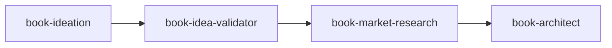

# Book Market Research

> Assess commercial viability of book concepts for Amazon KDP self-publishing. Produces a Market Research Report with viability scorecard and Go/No-Go recommendation. Works standalone or after idea-validator.

---

## Overview

The Book Market Research skill determines if a book is worth writing from a business perspective, specifically for Amazon KDP self-publishing. It answers the question: "Setting aside whether this is a good idea, can it succeed commercially?"

A key insight: **commercial viability is separate from intellectual merit.** A brilliant idea can fail commercially. A mediocre idea can succeed. This skill assesses the market, not the idea itself.

Author intent shapes interpretation—the same viability score means different things depending on whether you're writing for income, authority, passion, or lead generation.

---

## Quick Start

### Prerequisites

- Book Concept Document (required)
- Validation Report (optional but recommended)

### Basic Usage

=== "Claude Code"

    ```markdown
    When researching book market viability, read and follow /path/to/claude-skills/non-fiction-book-factory/book-market-research/SKILL.md.
    ```

=== "Claude.ai"

    Upload `book-market-research.skill` to Settings → Skills.

**Sample prompt:**
```
I want to assess the commercial viability of my book concept. Here's my Book Concept Document: [paste document]
```

---

## Features

| Feature | Description |
|---------|-------------|
| **Author Intent Calibration** | Interprets scores based on your goals (income, authority, passion, lead gen) |
| **Quick Assessment Mode** | Single-session qualitative analysis |
| **Deep Dive Mode** | Multi-session with quantitative Amazon data |
| **8-Criterion Viability Scorecard** | Weighted scoring across key factors |
| **Positioning Recommendations** | How to differentiate in the market |
| **Pricing Guidance** | Market-informed pricing strategy |

---

## Session Modes

### Quick Assessment (Single Session)

- Claude-only qualitative analysis via web search
- Identifies competitors, positioning gaps, review themes
- Produces preliminary viability assessment
- **Best for:** Early-stage filtering, passion/legacy authors, experienced KDP authors

### Deep Dive (Multi-Session)

- Full qualitative analysis PLUS quantitative data
- Claude provides pre-filled CSV with competitor URLs
- You gather BSR, prices, review counts from Amazon
- Claude analyzes completed data for full scorecard
- **Best for:** Income-focused authors, competitive categories, first-time KDP authors

---

## Author Intent

Your intent determines how to interpret the viability score:

| Intent | Description | Score Interpretation |
|--------|-------------|---------------------|
| **Income** | Book must generate revenue | Score is decisive—low = revise or kill |
| **Authority** | Book is a credential | Moderate score OK if positioning strong |
| **Passion/Legacy** | "This book needs to exist" | Low score = proceed with eyes open |
| **Lead Generation** | Funnel for services | Score less critical if book serves funnel |
| **Audience Service** | Serving existing followers | Platform strength matters more |

---

## Viability Scorecard

| Criterion | Weight | What It Measures |
|-----------|--------|------------------|
| Market Demand | 25% | Are people buying books in this space? |
| Review Landscape | 15% | Review patterns, gap signals from complaints |
| Competition Gap | 15% | Differentiation opportunity |
| Author Credibility | 15% | Does background match claims? |
| Pricing Viability | 10% | Can price competitively with margin? |
| Author Platform | 10% | Existing audience for launch velocity |
| Timing | 5% | Trend momentum vs. evergreen |
| Production Feasibility | 5% | Can this realistically be written? |

---

## Score Interpretation

| Score | Label | Meaning |
|-------|-------|---------|
| 7.0+ | **Strong Go** | Market conditions favor success |
| 5.5–6.9 | **Conditional Go** | Viable with strategic adjustments |
| 4.0–5.4 | **Revise** | Significant concerns—reposition or reconsider |
| <4.0 | **Kill** | Market conditions unfavorable |

**Intent Overlay:**

- Income authors: Follow score literally
- Authority authors: Conditional Go sufficient if positioning strong
- Passion authors: Even Kill score = proceed with eyes open
- Lead Gen authors: Platform fit matters more than raw score

---

## Workflow

### Starting Research

1. Provide Book Concept Document (and Validation Report if available)
2. Claude asks about author intent
3. Claude recommends session mode with reasoning
4. You confirm mode
5. Proceed to research

### Quick Assessment Flow

1. Search for competing books
2. Analyze: competitor positioning, bestseller signals, review themes
3. Identify market gaps
4. Assess author credibility fit
5. Produce preliminary Market Research Report

### Deep Dive Flow

**Phase 1:** Quick Assessment steps + identify 5-8 key competitors

**Phase 2:** Claude generates pre-filled CSV; you gather Amazon data (~10 min)

**Phase 3:** Claude analyzes completed data for full scorecard

---

## Inputs & Outputs

### Inputs

| Input | Required | Source |
|-------|----------|--------|
| Book Concept Document | Yes | book-ideation |
| Validation Report | Recommended | book-idea-validator |
| Author intent declaration | Yes | Asked at session start |

### Outputs

| Output | Description |
|--------|-------------|
| Market Research Report | Full analysis with scorecard and recommendation |
| Competitor Analysis CSV | Quantitative data (Deep Dive only) |
| Positioning Recommendations | How to differentiate |
| Pricing Recommendations | Market-informed pricing |
| Title/Subtitle Direction | Market-informed suggestions |

---

## Market Research Report Structure

1. **Executive Summary** — Overall assessment and recommendation
2. **Author Intent & Interpretation** — How intent shapes recommendation
3. **Viability Scorecard** — Weighted scores with reasoning
4. **Competitive Landscape** — Top competitors and gaps
5. **Target Reader Analysis** — Refined persona, underserved needs
6. **Positioning Recommendation** — How to differentiate
7. **Pricing Recommendation** — Based on market analysis
8. **Title/Subtitle Direction** — Market-informed suggestions
9. **Platform Fit Assessment** — Existing audience leverage
10. **Timing Assessment** — Trend vs. evergreen
11. **Key Risks** — What could derail success
12. **Recommendation** — Go / Conditional Go / Revise / Kill

---

## Best Practices

- **Declare intent honestly** — It shapes interpretation
- **Do the data gathering** — 10 minutes on Amazon provides valuable quantitative insight
- **Consider both validation and market** — Intellectual merit ≠ commercial viability
- **Use positioning guidance** — The how-to-differentiate matters as much as go/no-go

---

## Integration

### Pipeline Position



### Dependency Modes

**Standalone Mode:** Book Concept Document only → pure commercial analysis

**Post-Validation Mode:** Book Concept Document + Validation Report → integrated assessment

### Upstream Skills

- **book-ideation** — Provides Book Concept Document
- **book-idea-validator** — Provides Validation Report (optional)

### Downstream Skills

- **book-architect** — Receives Market Research Report + positioning guidance

---

## Scope Boundaries

This skill assesses **commercial viability**, not:

- Intellectual merit (that's [book-idea-validator](book-idea-validator.md))
- Book structure (that's [book-architect](book-architect.md))
- Writing quality (that's the editing pipeline)

---

## Related Skills

- [Book Idea Validator](book-idea-validator.md) — Intellectual merit assessment
- [Book Ideation](book-ideation.md) — Create the concept document
- [Book Architect](book-architect.md) — Next step after market research
