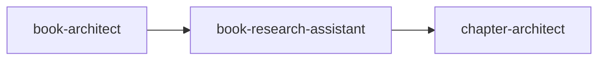

# Book Research Assistant

> Plan, orchestrate, and validate deep research for nonfiction books. The research quality gate—does everything around research (planning, prompting, validating, organizing) while you execute actual deep research using Claude and Gemini.

---

## Overview

The Book Research Assistant plans, orchestrates, and validates deep research for nonfiction books. This skill is the research quality gate—it handles everything around the research (planning, prompting, validating, organizing, certifying readiness) while you execute the actual deep research using Claude and Gemini externally.

Core principles guide this work: **reader-first research** (every gap filled serves the reader's transformation), **truth over thesis** (if research contradicts the book's argument, surface it immediately), and **verify everything** (LLM research can hallucinate—sources need checking).

---

## Quick Start

### Prerequisites

- Research Gaps Document (from book-architect)
- Book Concept Document (from book-ideation)
- Master Architecture Document (from book-architect)
- Section Blueprint Documents (from book-architect)

### Basic Usage

=== "Claude Code"

    ```markdown
    When planning or validating book research, read and follow /path/to/claude-skills/non-fiction-book-factory/book-research-assistant/SKILL.md.
    ```

=== "Claude.ai"

    Upload `book-research-assistant.skill` to Settings → Skills.

**Sample prompt:**
```
I'm ready to start research for my book. Here are my architecture documents: [paste documents]
```

---

## Features

| Feature | Description |
|---------|-------------|
| **Two-Phase Operation** | Planning (generate prompts) + Validation (verify outputs) |
| **Gap Expansion** | Identifies gaps architect may have missed |
| **Self-Contained Prompts** | Each prompt includes full context for standalone use |
| **7-Dimension Validation** | Coverage, depth, source quality, contradictions, thesis tension, usability, gap spawning |
| **Dual-Model Requirement** | Both Claude and Gemini outputs for P1 gaps |
| **Chapter Summaries** | Distills findings per chapter |
| **Final Synthesis** | Book-wide research synthesis with readiness certification |

---

## Two Phases

### Phase 1: Research Planning

- Review and expand gaps from book-architect
- Generate self-contained research prompts
- Initialize tracking documents

### Phase 2: Research Validation

- Review research outputs gap by gap
- Render verdicts (Complete, Needs More, Problematic)
- Produce chapter summaries
- Certify readiness for next phase

---

## Workflow

### Smart Triage at Session Start

Claude guides you to the right entry point:

| Scenario | What to Provide | Next Action |
|----------|-----------------|-------------|
| New book, first chapter | All upstream docs | Initialize trackers, start planning |
| Continuing, new chapter | Book-Level Tracker | Initialize Chapter Tracker |
| Continuing, validation | Trackers + research files | Begin gap-by-gap validation |
| Thesis pivot | All docs | Assess impact, regenerate prompts |
| Final synthesis | All Chapter Summaries | Produce Final Research Synthesis |

### Planning Flow

1. **Review Architect's Gaps** — Assess if well-formed and specific enough
2. **Expand and Enhance** — Determine evidence types, proof burdens
3. **Initialize Chapter Tracker** — All gaps with IDs, priorities, statuses
4. **Generate Research Prompts** — Self-contained prompts for each gap
5. **Update Trackers** — Mark all gaps as "Prompt Ready"

### Research Prompt Structure

Each prompt includes:

1. Book Context (thesis, reader, transformation)
2. Chapter Context (position, purpose, entry/exit states)
3. The Research Gap (ID, priority, clear statement)
4. Author's Existing Position
5. Evidence Type Needed
6. Scope & Boundaries
7. Source Requirements
8. Quality Criteria
9. Search Guidance
10. Special Requests
11. Output Format

### Validation Flow

For each gap:

1. **Confirm Gap** — State which gap is being validated
2. **Request Research** — Claude + Gemini outputs
3. **Thorough Review** — Assess against 7 dimensions
4. **Render Verdict** — Complete / Needs More / Problematic
5. **Update Tracker** — Status, model coverage, quality verdict
6. **Proceed** — Next gap

---

## Validation Dimensions

| Dimension | Question |
|-----------|----------|
| Coverage | Did the research actually answer the question? |
| Depth | Enough evidence for how chapter will use it? |
| Source Quality | Verifiable, authoritative, properly cited? |
| Contradiction Check | Did Claude and Gemini agree? |
| Thesis Tension | Anything challenge the book's thesis? |
| Usability | Specific, quotable, concrete for drafting? |
| Gap Spawning | Did answering reveal NEW gaps? |

---

## Verdicts

| Verdict | Meaning | Action |
|---------|---------|--------|
| **Complete** | Research satisfies all dimensions | Gap is filled |
| **Needs More** | Research fell short | Follow-up prompt generated |
| **Problematic** | Thesis tension or serious issue | Author decision required |

---

## Inputs & Outputs

### Inputs

| Input | Required | Source |
|-------|----------|--------|
| Research Gaps Document | Yes | book-architect |
| Book Concept Document | Yes | book-ideation |
| Master Architecture Document | Yes | book-architect |
| Section Blueprint Documents | Yes | book-architect |
| Research outputs | During validation | Claude + Gemini |

### Outputs

| Document | Description |
|----------|-------------|
| **Book-Level Research Tracker** | Status of all chapters |
| **Chapter Research Tracker** | Gaps, statuses, verdicts per chapter |
| **Research Prompt Files** | One per gap, fully self-contained |
| **Follow-up Prompt Files** | For "Needs More" scenarios |
| **Chapter Research Summary** | Distillation of findings per chapter |
| **Final Research Synthesis** | Book-wide synthesis + readiness certification |

---

## Chapter Completion Checklist

- [ ] All P1 gaps marked Complete
- [ ] All P2 gaps Complete or explicitly deferred
- [ ] P3 gaps addressed or consciously skipped
- [ ] No unresolved "Problematic" verdicts
- [ ] Both models run for P1 gaps
- [ ] Source quality sufficient for fact-checking
- [ ] No critical gap-spawned items unaddressed

---

## Readiness Criteria

Research phase is complete when:

1. All chapters show Complete on Book-Level Tracker
2. All Chapter Research Summaries produced
3. Final Research Synthesis completed
4. All P1 and P2 gaps filled
5. No unresolved Problematic verdicts
6. Architecture feedback consolidated
7. Author confirms readiness to proceed

---

## Best Practices

- **Work one gap at a time** — Precision over speed
- **Use both models for P1 gaps** — Claude + Gemini reduces hallucination risk
- **Surface thesis tensions immediately** — Better to know now
- **Verify sources** — LLMs hallucinate; check critical citations
- **Track everything** — The trackers are your map

---

## Integration

### Pipeline Position



### Upstream Skills

- **book-architect** — Provides Research Gaps Document + Architecture docs
- **book-ideation** — Provides Book Concept Document

### Downstream Skills

- **chapter-architect** — Receives Final Research Synthesis + Chapter Summaries

### Upstream Feedback Loop

If research reveals architectural problems:

- Architecture Feedback consolidated from Chapter Summaries
- Sent back to **book-architect** for structural revisions

---

## References

The skill loads these as needed:

- `source-evaluation-guide.md` — Assessing source quality
- `evidence-types-catalog.md` — Types of evidence and when appropriate
- `research-question-formulation.md` — Turning gaps into sharp questions
- `deep-research-prompting.md` — Best practices for Claude/Gemini
- `contradiction-reconciliation.md` — Handling conflicts
- `proof-burden-matching.md` — What evidence claims require

---

## Related Skills

- [Book Architect](book-architect.md) — Creates the Research Gaps Document
- [Chapter Architect](chapter-architect.md) — Uses research to plan chapters
- [Book Ideation](book-ideation.md) — Creates the Book Concept Document
