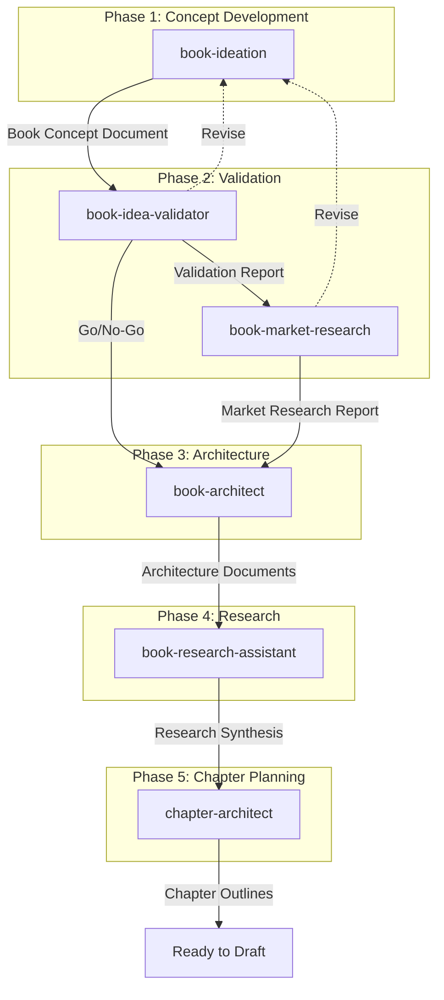

# Non-Fiction Book Factory

> A comprehensive pipeline that replicates traditional publishing infrastructure for nonfiction book creation using specialized Claude skills.

## Overview

The Non-Fiction Book Factory is a suite of six interconnected skills that guide authors from initial idea to chapter-level outlines ready for drafting. Each skill specializes in one phase of the book development process, producing structured output that the next skill consumes.

Traditional publishing provides authors with developmental editors, fact-checkers, market researchers, and structural consultants. Self-published authors typically lack access to this infrastructure. This pipeline replicates that expertise using Claude, creating a "book factory" with specialized skills for each phase.

The factory is built on a core principle: **every decision serves the reader.** The question is never "what do I want to say?" but "what transformation does the reader need, and how can this book deliver it?"

## Pipeline Flow

## Skills Overview

| Skill | Phase | Purpose | Primary Output |
|-------|-------|---------|----------------|
| [Book Ideation](book-ideation.md) | Concept | Develop raw ideas into structured concepts | Book Concept Document |
| [Book Idea Validator](book-idea-validator.md) | Validation | Stress-test ideas against research | Validation Report |
| [Book Market Research](book-market-research.md) | Validation | Assess commercial viability | Market Research Report |
| [Book Architect](book-architect.md) | Architecture | Design structural and emotional architecture | Master Architecture + Section Blueprints |
| [Book Research Assistant](book-research-assistant.md) | Research | Fill research gaps with validated evidence | Research Synthesis |
| [Chapter Architect](chapter-architect.md) | Planning | Create beat-level chapter outlines | Chapter Outline Documents |

## When to Use This Pipeline

**Use the Non-Fiction Book Factory when you:**

- Have a nonfiction book idea you want to develop systematically
- Want to validate ideas before investing months in writing
- Need structured architecture that serves the reader's journey
- Want to ensure your book stands out in the marketplace
- Are self-publishing through Amazon KDP
- Want a repeatable, professional process for book development

**This pipeline is NOT for:**

- Fiction (requires different approaches)
- Quick ebooks or lead magnets (see Ebook Factory)
- Academic papers or articles
- Blog post series

## Philosophy and Approach

### Reader-First Decision Making

Every decision in the pipeline--structural, stylistic, content--is evaluated from the reader's perspective:

- Will this help the reader understand?
- Will this keep the reader engaged?
- Will this move the reader toward transformation?

### Validate Before Investing

The pipeline includes explicit validation gates to prevent wasted effort. Phase 2 (Validation) provides a Go/Revise/Kill decision point before committing to architecture and drafting.

### Honest Feedback

Skills are designed to challenge weak thinking and surface problems early. Claude functions as an intellectual partner, not a yes-man. Better to kill a weak idea now than to finish a weak book later.

### Explicit Handoffs

Each skill produces structured output that the next skill consumes. Documents are versioned (v1, v2, v3) so progress can be tracked and earlier versions referenced.

## Workflow

1. **Start with ideation** - Run `book-ideation` to develop your raw idea into a structured concept with eight core elements

2. **Validate the concept** - Run `book-idea-validator` to stress-test against research, then `book-market-research` to assess commercial viability

3. **Make the Go/No-Go decision** - Review both reports and decide whether to proceed, revise, or kill the project

4. **Architect the book** - Run `book-architect` to design the complete structural and emotional architecture

5. **Conduct research** - Run `book-research-assistant` to plan research prompts, execute deep research externally, then validate findings

6. **Plan each chapter** - Run `chapter-architect` to create beat-level outlines for individual chapters before drafting

## Key Documents

The pipeline produces these core artifacts:

| Document | Created By | Used By |
|----------|-----------|---------|
| Book Concept Document | book-ideation | idea-validator, market-research, book-architect |
| Validation Report | book-idea-validator | market-research, book-architect |
| Market Research Report | book-market-research | book-architect |
| Master Architecture Document | book-architect | book-research-assistant, chapter-architect |
| Section Blueprint Documents | book-architect | book-research-assistant, chapter-architect |
| Research Gaps Document | book-architect | book-research-assistant |
| Chapter Research Summaries | book-research-assistant | chapter-architect |
| Final Research Synthesis | book-research-assistant | chapter-architect |
| Chapter Outline Documents | chapter-architect | draft-coach, ghostwriter |

## Getting Started

1. **Prepare your starting material** - This can be:
   - A raw idea (one sentence or paragraph)
   - Brainstorm documents
   - Zettelkasten notes or research collection
   - An existing partial concept

2. **Invoke book-ideation** - Share your material and work through the eight elements

3. **Follow the pipeline** - Each skill will guide you to the next step

## Related Resources

- [Book Ideation](book-ideation.md) - Start here
- [Book Idea Validator](book-idea-validator.md) - Stress-test your concept
- [Book Market Research](book-market-research.md) - Assess viability
- [Book Architect](book-architect.md) - Design structure
- [Book Research Assistant](book-research-assistant.md) - Fill research gaps
- [Chapter Architect](chapter-architect.md) - Plan chapters
