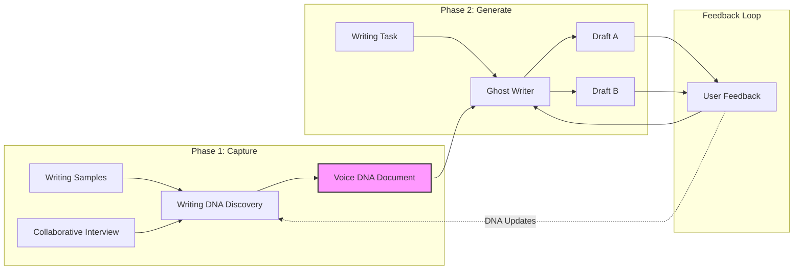

# Writing Skills

> A pipeline for capturing and replicating a writer's authentic voice.

## Overview

The Writing Skills pipeline solves a fundamental challenge in AI-assisted writing: producing drafts that genuinely sound like you, not like generic AI output. Rather than relying on vague style descriptions or hope, this pipeline takes a systematic approach to voice capture and application.

The workflow has two phases. First, **Writing DNA Discovery** captures the "genetic code" of your voice through collaborative analysis and interview. This produces a structured Voice DNA Document containing patterns, anti-patterns, exemplar passages, and actionable guidance. Second, **Ghost Writer** consumes that document to generate first drafts at approximately 80% voice accuracy. You add the remaining 20%: the creative spark, situational judgment, and final polish.

This is not about replacing the writer. It is about giving you a strong starting point that sounds like you, saving the mental energy of starting from scratch while preserving your distinctive voice.

## Pipeline Architecture

## Philosophy

### Voice Authenticity Over "Good Writing"

The goal is not to produce objectively "good" writing. The goal is to produce writing that sounds like you. A distinctive voice may include patterns that writing guides would discourage, but those patterns are part of what makes your writing recognizably yours.

### 80% Accuracy Target

The skills aim for 80% voice accuracy in first drafts. This is intentional. The remaining 20% is where your creative judgment, situational awareness, and final polish come in. These skills accelerate your process; they do not replace your input.

### Living Documents

Your Voice DNA Document is not static. Initial discovery captures the foundation. Return sessions deepen, refine, and adapt as your voice evolves. Each round of ghost writing feedback becomes material for DNA refinement.

### Anti-Patterns Are Critical

What you do not do is as important as what you do. The DNA document captures words, structures, and tones that would make readers think "that is not their writing." This includes AI patterns that must be actively suppressed.

### One Register Per Session

Each discovery session focuses on a single mode: blog posts, fiction prose, technical writing, newsletters. Different contexts may call for different voices. Create separate DNA documents if your voice varies significantly across registers.

## Skills in This Pipeline

| Skill | Purpose | Input | Output |
|-------|---------|-------|--------|
| [Writing DNA Discovery](./writing-dna-discovery.md) | Capture voice patterns through interview and sample analysis | Writing samples + conversation | Voice DNA Document |
| [Ghost Writer](./ghost-writer.md) | Generate first drafts matching captured voice | Voice DNA Document + writing task | Two meaningfully different drafts |

## Readiness Levels

Your Voice DNA Document has a readiness level that affects ghost writing accuracy:

| Level | Accuracy | What It Means |
|-------|----------|---------------|
| **Minimum Viable** | 60-70% | 3-5 strong patterns, clear tone, key anti-patterns documented |
| **Solid** | 75-85% | Multiple dimensions developed, exemplar passages annotated, stress-tested |
| **Strong** | 85-90% | Deep analysis across dimensions, validated against output, refined from feedback |

## Getting Started

### First-Time Users

1. **Gather writing samples**: Collect 3-5 pieces that represent your authentic voice. Choose writing you are proud of, not pieces that were heavily edited by others.

2. **Run Writing DNA Discovery**: Provide your samples and engage in the collaborative interview. Be honest about what is truly "you" versus aspirational patterns.

3. **Reach Minimum Viable readiness**: Continue the session until the skill confirms at least Minimum Viable status. This typically takes one focused session.

4. **Run Ghost Writer**: Provide your Voice DNA Document and a writing task. Review both drafts, noting what works and what feels off.

5. **Iterate and refine**: Use feedback to improve drafts within the session. After multiple sessions, return to DNA Discovery to refine your profile based on what the ghost writer consistently gets wrong.

### Returning Users

- **New writing task**: Run Ghost Writer with your existing DNA document
- **Voice has evolved**: Run a DNA Discovery evolution session
- **Ghost writer keeps missing something**: Run a DNA Discovery refinement session to convert feedback into explicit anti-patterns
- **New writing context**: Run a DNA Discovery session for the new register (creates a separate DNA document)

## Key Concepts

### Voice Dimensions

The DNA Discovery skill analyzes multiple dimensions of voice:

**Core Dimensions** (always explored):
- Sentence Rhythm: length variation, internal structure, emphasis placement
- Punctuation Personality: em-dashes, semicolons, parentheses, comma density
- Word Choice: vocabulary level, favorites, avoided words
- Tone and Temperature: warm/cool, formal/casual, confident/hedging
- Reader Relationship: first person presence, direct address, authority stance

**Extended Dimensions** (as relevant):
- Opening Moves: how pieces begin
- Closing Moves: how pieces end
- Structural Patterns: paragraph construction, transitions
- Confidence/Hedging: qualifier density, uncertainty handling
- Humor Approach: type, placement, frequency
- Signature Elements: distinctive moves, pet phrases

### The Voice DNA Document

The output of DNA Discovery is a structured document containing:

- **Quick Reference**: Core temperature, sentence signature, distinctive moves, never-dos
- **Voice Profile**: Dimension-by-dimension analysis with examples
- **Exemplar Passages**: Annotated excerpts demonstrating patterns in action
- **Anti-Patterns**: What to avoid, including AI patterns to suppress
- **Ghost Writer Briefing**: Do This, Don't Do This, When Uncertain rules
- **Profile Metadata**: Readiness level, confidence assessment, gaps

### Dual-Draft Approach

Ghost Writer always produces two meaningfully different drafts. Differences might include:

- Structural approach (narrative vs. analytical)
- Opening strategy (direct hook vs. scene-setting)
- Tone variation (within documented range)
- Emphasis (different aspects highlighted)

This gives you options and reveals trade-offs rather than presenting a single "correct" interpretation.

## When to Use Each Skill

| Scenario | Skill to Use |
|----------|--------------|
| First time capturing your voice | Writing DNA Discovery (Initial Discovery) |
| Adding new samples to existing profile | Writing DNA Discovery (Sample Addition) |
| Exploring a specific dimension deeper | Writing DNA Discovery (Dimension Deep-Dive) |
| Ghost writer keeps getting something wrong | Writing DNA Discovery (Refinement from Feedback) |
| Your writing style has changed | Writing DNA Discovery (Evolution Update) |
| Capturing voice for different context | Writing DNA Discovery (New Register) |
| Need a first draft for a writing task | Ghost Writer |
| Need blog post, essay, or newsletter draft | Ghost Writer |
| Need LinkedIn post or Twitter thread | Ghost Writer |

## Integration Notes

The Writing Skills pipeline is designed to be self-contained but can integrate with other workflows:

- **Research phase**: Gather materials before running Ghost Writer. The skill will ask about research sufficiency and can work with provided context.
- **Editing phase**: Drafts from Ghost Writer are starting points. Apply your editing process as you normally would.
- **Series writing**: Provide Ghost Writer with prior pieces to maintain continuity across a series.

## Best Practices

1. **Be honest during discovery**: The DNA document captures your actual voice. If you want to evolve your voice, note that explicitly so the skill can capture both current patterns and aspirational direction.

2. **Provide diverse samples**: Include pieces from different moods, topics, and lengths to capture the full range of your voice.

3. **Engage in the interview**: The collaborative dialogue surfaces patterns you may not consciously recognize. Push back when something does not feel right.

4. **Read drafts aloud**: Voice patterns are often most apparent when you hear them. Read Ghost Writer output aloud to spot what feels "off."

5. **Give specific feedback**: "This doesn't sound like me" is less useful than "I would never start a paragraph with 'However'" or "These sentences are too long for my voice."

6. **Iterate on the DNA document**: The profile improves with use. Return to DNA Discovery when you notice patterns the ghost writer consistently misses.
